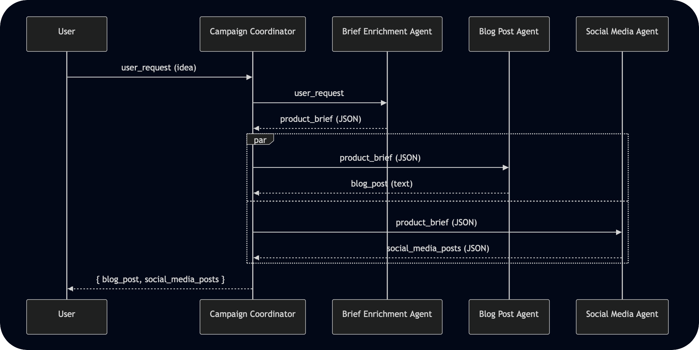

# LaunchPad Marketing: AI Content Campaign Generator

This repository contains the proof-of-concept for an AI-powered content generation system, built for the "LaunchPad Marketing" agency. The solution uses a multi-agent framework to automate the creation of a complete marketing campaign package from a single, high-level product idea.

---

## How It Works: The Multi-Agent Workflow

The system is designed around a "Campaign Coordinator" that orchestrates a series of specialized agents to ensure a consistent and comprehensive output.

The workflow proceeds in a non-negotiable sequence:

1.  **Initial Idea**: The process starts when a user provides a simple, high-level product idea (e.g., "an app for tracking garden plants").

2.  **Brief Enrichment**: The `campaign_coordinator` first passes this idea to the **`brief_enrichment_agent`**. This agent, acting as an expert Product Marketing Strategist, fleshes out the vague concept into a complete, structured JSON product brief. It creatively invents a catchy product name, defines a target audience, and writes three compelling key features.

3.  **Content Delegation**: The `campaign_coordinator` then uses the newly generated product brief as the single source of truth for all subsequent content. It delegates tasks to two specialist agents:
    * The **`blog_post_agent`** (a Junior Copywriter) receives the brief and is tasked with writing a full-length product announcement blog post.
    * The **`social_media_agent`** (a Social Media Coordinator) receives the same brief and is tasked with generating a package of tailored posts for different platforms.

4.  **Final Package**: Finally, the `campaign_coordinator` consolidates the outputs from the specialist agents into a single, cohesive JSON object containing the complete campaign package: a blog post and a set of social media posts.




---

## Core Features

This solution is composed of several distinct agents, each with a specific role:

### **Campaign Coordinator Agent**

* **Role**: The central orchestrator.
* **Function**: Manages the entire content creation workflow from start to finish. It takes the initial user request, invokes the necessary specialist agents in the correct order, and consolidates their outputs into the final package.

### **Brief Enrichment Agent**

* **Role**: A Product Marketing Strategist.
* **Function**: Transforms a vague user idea into a detailed and structured JSON product brief, inventing a plausible product name, description, key features, and target audience. This ensures the content generation agents have a high-quality, consistent input.

### **Blog Post Agent**

* **Role**: A Junior Copywriter.
* **Function**: Generates a well-structured and engaging product announcement blog post of approximately 400-500 words, complete with a title, introduction, body paragraphs for each key feature, and a concluding call-to-action.

### **Social Media Agent**

* **Role**: A Social Media Coordinator.
* **Function**: Creates a set of platform-specific social media posts based on the product brief. It generates a professional post for **LinkedIn**, a concise and punchy post for **X / Twitter**, and an engaging, emoji-rich caption for **Instagram**. The output is a clean JSON object.

---

## Technology Stack

* **AI Framework**: **Google Agent Development Kit (ADK)** for structuring and running the agents.
* **Generative AI Model**: **Google Gemini** (`gemini-2.5-flash`) powers the creative text generation for all agents.
* **Language**: Python
* **Deployment Target**: Designed to be deployed on **Google Cloud**, using services like Cloud Run or Vertex AI.

---

## Getting Started

Follow these instructions to run the AI Content Campaign Generator on your local machine.

### **1. Prerequisites**

* Python 3.9+
* A Google Cloud project with the AI Platform API enabled.
* Your Google AI Studio API key.

### **2. Installation**

Clone the repository to your local machine:

```bash
git clone https://github.com/jkleinne/strataprime-genai-assignment
cd strataprime-genai-assignment
```

Create and activate a Python virtual environment:

```bash
python -m venv venv
source venv/bin/activate
# On Windows, use: venv\Scripts\activate
```

Install the required dependencies from `agents/requirements.txt`:

```bash
pip install -r agents/requirements.txt
```

### **3. Configuration**

Create a file named `.env` in the root directory of the project. This file will hold your Google API key along with others necessary for `adk deploy`. Run `source .env`.

```
# .env
GOOGLE_API_KEY=
GOOGLE_CLOUD_PROJECT=
GOOGLE_CLOUD_LOCATION=
GOOGLE_GENAI_USE_VERTEXAI=FALSE
AGENT_PATH=./agents
SERVICE_NAME=
```

### **4. Running the Agent**

Use the Google ADK command-line tool to run the root agent (`agents/agent.py`). This will start an interactive prompt in your terminal where you can interact with the system.

```bash
adk run agents
```

Alternatively, you can start the web tool which should start the server on `127.0.0.1:8000`:

```bash
adk web
```

---

## Usage Example

Once the agent is running, you can interact with it by sending a prompt (high-level or detail-oriented both work):


> The idea is to have something with the ability to deploy multiple simulations / instances of a program we developed internally. The system should be able to choose the server based on resource usage and load or spin up new servers as necessary. This is to be used by astronaut candidates.


### **Expected Output**

The agent will process the request through the entire workflow and return a consolidated JSON object containing the final campaign assets:

```json
{
  "blog_post": "Launch into the Future: Announcing Aether Foundry, the Ultimate Simulation Platform for Astronaut Training!\n\nAre you tired of grappling with complex setup times, resource bottlenecks, or unreliable performance when preparing your elite astronaut candidates for the unforgiving cosmos? The future of space exploration demands training as boundless as space itself. That’s why we’re thrilled to unveil **Aether Foundry**, a revolutionary cloud-agnostic simulation platform designed to transform how space agencies and aerospace companies prepare their future pioneers. Aether Foundry delivers instantly scalable, high-fidelity training environments, autonomously optimizing resource allocation for peak performance, every single time.\n\nFirst up, say goodbye to frustrating wait times with **Dynamic Instance Provisioning**. Imagine needing a dedicated training environment for a single candidate practicing a complex spacewalk, or for a team rehearsing an orbital rendezvous. Aether Foundry lets you instantly spin up and tear down multiple, isolated simulation instances. This means each astronaut candidate or team gets their own pristine, high-performance training ground, completely free from the distractions and limitations of shared resources. No more queuing, no more setup headaches – just pure, unadulterated training when and where you need it, ensuring every moment counts.\n\nNext, we're bringing unparalleled stability with **Intelligent Resource Balancing (IRB)**. High-fidelity simulations demand immense computational power, and a sudden lag can ruin a critical training moment. IRB is Aether Foundry's brain, constantly monitoring server load and resource availability (CPU, GPU, RAM) across your entire infrastructure. It intelligently distributes simulation instances or even provisions new server capacity on-demand, all autonomously. This ensures your simulations run smoothly, guaranteeing uninterrupted, lag-free training even during peak usage. Your focus stays on the mission, not on technical glitches, providing the reliable foundation your critical training deserves.\n\nFinally, for team-based missions and comprehensive analysis, **Collaborative Scenario Replication** is a game-changer. Whether you need multiple candidates tackling the exact same emergency procedure in parallel or working together in a synchronized environment, Aether Foundry makes it seamless. This feature allows for the synchronized or parallel deployment of identical training scenarios for multiple candidates or teams, fostering powerful collaborative exercises. It also enables precise comparative performance analysis and highly effective post-simulation debriefings, all built on shared, reproducible data sets. Prepare your teams not just as individuals, but as cohesive units ready for any challenge the cosmos throws at them.\n\nAether Foundry isn't just a platform; it's your launchpad to unparalleled training excellence. By eliminating common hurdles and optimizing performance, it empowers space agencies and aerospace companies to prepare their future astronauts with unprecedented efficiency and fidelity. Ready to elevate your training programs? Visit our website or contact us today for a personalized demo and discover how Aether Foundry can transform your mission preparation!",
  "social_media_posts": {
    "linkedin_post": "LaunchPad Marketing is thrilled to announce Aether Foundry, our revolutionary cloud-agnostic simulation platform designed for the future of astronaut training. \n\nAether Foundry provides space agencies, private aerospace companies, and advanced research institutions with instantly scalable, high-fidelity training environments. Say goodbye to lag and setup delays, and hello to peak performance for your candidates.\n\nKey features include:\n🚀 Dynamic Instance Provisioning: Instantly create dedicated, high-performance simulation environments.\n🧠 Intelligent Resource Balancing (IRB): Guarantees uninterrupted, lag-free training by autonomously optimizing resources.\n🤝 Collaborative Scenario Replication: Facilitates synchronized training, comparative analysis, and reproducible debriefs.\n\nEmpower your astronaut candidates with the most advanced, reliable, and high-performance virtual environments available. Learn more about how Aether Foundry can transform your mission simulations.\n\n#AetherFoundry #SpaceTraining #Astronauts #SimulationPlatform #AerospaceInnovation #CloudAgnostic #MissionReadiness",
    "x_post": "🚀 Announcing Aether Foundry! The ultimate cloud-agnostic simulation platform for astronaut training. Instantly scalable, high-fidelity environments with intelligent resource optimization. Get peak performance, zero lag. #AetherFoundry #SpaceTech #AstronautTraining #Simulation #FutureIsNow #Aerospace",
    "instagram_caption": "Ready for launch! 🚀 We're beyond excited to introduce Aether Foundry, the groundbreaking simulation platform powering the next generation of astronaut training. Imagine instantly spinning up high-fidelity, lag-free training environments, perfectly optimized for your mission!\n\nWhether it's solo drills or collaborative team scenarios, Aether Foundry ensures every candidate gets the ultimate performance without limits. 💫\n\nTag a future astronaut who needs this! 👇\n\n#AetherFoundry #SpaceXperience #AstronautLife #FutureOfSpace #SimulationTech #TrainingGoals #Innovation #GetReadyForLaunch"
  }
}
```
Additionally, the system can be instructed to provide a human-readable format.

---

## Design Choices

* **Autonomous Brief Creation**: A key design choice was to add the `brief_enrichment_agent`. The assumption was that users (e.g., marketers) would provide high-level or vague ideas. This agent makes the system more robust and creative by building a solid foundation before any final content is written.
* **Structured I/O**: The agents communicate using strongly-typed JSON objects. This was a deliberate choice to ensure reliability, predictability, and to make the system easily extensible in the future.
* **Centralized Orchestration**: A key design choice was to use the "Campaign Coordinator" pattern. This avoids a simple, rigid chain of calls. The coordinator manages the whole process, first using the `brief_enrichment_agent` to create a solid product brief. It then passes that same brief to the `blog_post_agent` and `social_media_agent`, allowing them to work in parallel. This approach makes the system faster, more flexible, and allows for more complex logic and error handling.
